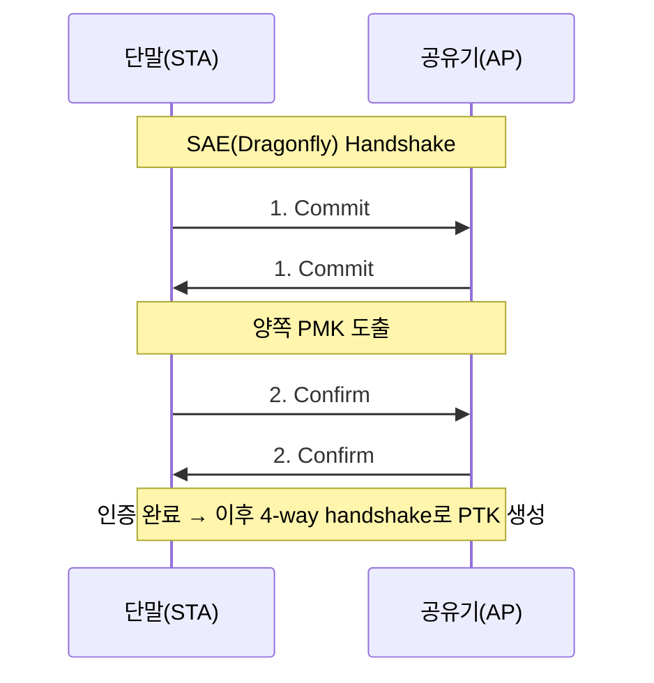

# 무선보안

## 한줄 요약
> 무선 암호화는 WEP(취약) → WPA(임시 개선) → WPA2(AES 표준) → WPA3(최신, 최고 보안)로 발전했다.

## 1. 무선 암호화 프로토콜 비교

| 프로토콜 | 암호화 알고리즘 | IV 길이 | 무결성 검증 | 인증 모드 | 보안 상태 |
|---|---|---|---|---|---|
| WEP | RC4 | 24비트(짧음) | CRC-32 | 공유키 인증 | 취약(IV 재사용 공격) |
| WPA | RC4 + TKIP | 48비트 | MIC(Michael) | WPA-PSK / 802.1X-EAP | WEP보다 개선, 여전히 취약 |
| WPA2 | AES + CCMP | - (CCMP 자체 처리) | CCM(AES 기반 인증) | WPA2-PSK / 802.1X-EAP | 안전(오랜 표준), KRACK 존재 |
| WPA3 | AES-256 + SAE | - | GCMP | SAE(개인)/802.1X-EAP(기업) | 최신, 가장 안전 |

**PSK는 "인증 모드"이지 암호화 알고리즘이 아님** — WPA-PSK, WPA2-PSK 둘 다 PSK(사전 공유키) 방식으로 인증하지만, 실제 **암호화는 TKIP(WPA) vs CCMP(WPA2)로 다름**. 즉 WPA와 WPA2를 가르는 건 PSK 여부가 아니라 **암호화 알고리즘(TKIP vs CCMP)**

## 2. 무결성 검증 방식 비교

| 방식 | 사용 프로토콜 | 특징 |
|---|---|---|
| CRC-32 | WEP | 단순 순환중복검사, 암호학적으로 취약(위변조 탐지 쉽게 우회됨) |
| MIC (Michael) | WPA | CRC-32보다 개선, 그래도 WPA2의 CCM보다는 약함 |
| CCM | WPA2 | AES 기반 인증 암호화, CCMP의 핵심 |
| GCMP | WPA3 | AES-GCM 기반, 가장 강력 |

## 3. 핵심 키워드

- **SSID**: 무선 네트워크 이름. 숨겨도 스니핑으로 쉽게 알아낼 수 있어 보안 수단으로는 약함
- **TKIP (Temporal Key Integrity Protocol)**: WPA에서 도입, 패킷마다 키를 다르게 써서 WEP의 취약점 보완
- **CCMP**: WPA2에서 사용하는 AES 기반 암호화 방식
- **SAE (Simultaneous Authentication of Equals)**: WPA3의 새로운 인증 방식, 4-way 핸드셰이크의 오프라인 사전공격 취약점(WPA2의 문제)을 보완
- **Evil Twin**: 정상 AP와 동일한 SSID로 위장한 가짜 AP를 만들어 사용자를 유인하는 공격
- **Rogue AP**: 조직 내부에 허가 없이 설치된 무단 AP (내부 보안 구멍이 됨)

## 4. 주요 무선 공격

| 공격 | 원리 |
|---|---|
| WEP 크래킹 | 짧은 IV 재사용을 이용해 키 유추 |
| Evil Twin | 가짜 AP로 사용자 유인, 트래픽 가로채기 |
| Deauth 공격 | 인증 해제 프레임을 위조해 정상 사용자 강제 연결 끊기 |
| KRACK | WPA2의 4-way 핸드셰이크 재전송 취약점을 이용한 키 재설치 공격 |

## 5. WEP 크래킹 원리 (IV 재사용)

```
WEP의 IV는 24비트(약 1600만 가지)뿐 → 트래픽 많은 AP에서는 금방 IV가 중복(재사용)됨
   → 같은 IV로 암호화된 패킷 여러 개 수집
   → RC4 키스트림 유추 가능 → 평문 복원/키 크래킹
```

## 암기 팁 (WEP/WPA/WPA2/WPA3)
- **버전 발전 순서**: "웹(WEP)은 약하다 → 더블유피에이(WPA)로 땜빵 → 더블유피에이투(WPA2)가 오래 쓴 표준 → 더블유피에이쓰리(WPA3)가 최신"
- **암호화 알고리즘**: "WEP·WPA는 RC4(스트림), WPA2부터 AES(블록)"
- **Evil Twin = "쌍둥이 행세"**, **Rogue AP = "몰래 설치된 불청객"**
- **무결성검증 발전**: "CRC(단순)→MIC(개선)→CCM(AES인증)→GCMP(최강)"
- **"PSK는 인증방식, TKIP/CCMP는 암호화방식"** — WPA와 WPA2를 가르는 건 암호화 알고리즘

## 6-1. WPA3의 3가지 모드 (WPA3-Personal 심화)

| 모드 | 대상 | 인증 방식 | 암호화 |
|---|---|---|---|
| WPA3-Personal | 가정/소규모 | **SAE**(동시 동등 인증) | AES-GCMP 128bit |
| WPA3-Enterprise | 기업 표준 | 802.1X/EAP(RADIUS서버) | AES-GCMP 128bit |
| WPA3-Enterprise 192-bit | 국방/금융 등 고보안 | 802.1X/EAP + **CNSA 스위트 강제** | AES-GCMP **192bit** |

```
WPA3
├── Personal (SAE, 가정용)
├── Enterprise (802.1X-EAP, 기업용)
└── Enterprise 192-bit (CNSA 스위트, 국가급 보안)

+ 별도 확장: OWE(Opportunistic Wireless Encryption)
   = 인증 없는 오픈 네트워크(카페 와이파이 등)에서도 암호화 제공
   = "Enhanced Open"이라고도 불림, WPA3와 함께 도입된 형제뻘 기술(WPA3의 4번째 모드 아님)
```

### SAE (Simultaneous Authentication of Equals) 상세

- WPA2의 4-way handshake **오프라인 사전공격(dictionary attack)** 취약점을 보완
- **Dragonfly Handshake**라고도 불림 — 타원곡선 기반 Diffie-Hellman 변형
- 매 인증 시도마다 AP와 **실시간 상호작용**이 필요 → 캡처한 패킷으로 오프라인 무한 대입 불가능
- **PFS(순방향 비밀성)** 지원: 장기키가 유출돼도 과거 세션은 안전



**WPA2 PSK vs WPA3 SAE**: PSK는 정적 공유키를 해시로 검증(캡처 후 오프라인 대입 가능), SAE는 시도마다 서버와 실시간 통신 필요(오프라인 대입 원천 차단)

## 암기 팁 (WPA3 모드)
- **"개인(Personal)-회사(Enterprise)-국정원(192bit)"** — 등급 올라갈수록 인증주체가 개인→회사서버→국가급 암호스위트
- **"드래곤(Dragonfly)이 문 앞에서 매번 직접 확인한다"** — WPA2는 자물쇠 걸어두고 감(오프라인 대입 가능), WPA3는 문지기가 매번 직접 나와 확인(온라인만 가능)
- **"SAE = 새(SAE)가 매번 직접 날아와서 확인"**

## 7. IEEE 802.11i 키 관리

802.11i는 **4-Way Handshake**로 PMK에서 PTK(유니캐스트용)와 GTK(브로드캐스트용)를 안전하게 유도·분배하는 키 계층 구조를 정의.

### 키 계층 구조

| 키 | 생성 방식 | 용도 | 수명 |
|---|---|---|---|
| PMK (Pairwise Master Key) | PSK방식: 패스워드→PBKDF2 / 802.1X방식: EAP인증 후 AS가 생성해 AP로 전달 | 세션 최상위 마스터키 | 인증 세션 동안 유지 |
| PTK (Pairwise Transient Key) | PMK+ANonce+SNonce+AP MAC+STA MAC → PRF | 유니캐스트 트래픽 암호화 | 4-Way Handshake마다 갱신 |
| GTK (Group Temporal Key) | AP가 임의 생성, PTK로 암호화해 STA에 전달 | 브로드캐스트/멀티캐스트 암호화 | 그룹키 갱신 주기마다 갱신 |
| GMK (Group Master Key) | AP 내부 생성 | GTK 유도의 상위키 | AP 내부 관리 |

**PTK의 하위 구성 3개**
- KCK (Key Confirmation Key): 4-Way Handshake 메시지 무결성(MIC) 검증
- KEK (Key Encryption Key): GTK 등 키 데이터 암호화 전달
- TK (Temporal Key): 실제 데이터 프레임 암호화(CCMP/TKIP)

### 4-Way Handshake 흐름

```
STA(단말)                              AP
   |<-- 1. ANonce ----------------------|
   (STA: SNonce 생성 후 PTK 계산)
   |-- 2. SNonce + MIC ----------------->|
                                    (AP: PTK 계산 완료)
   |<-- 3. GTK(KEK로 암호화) + MIC -------|
   (STA: GTK 설치)
   |-- 4. ACK(설치확인) + MIC ----------->|
   (이후 TK로 데이터 암호화 시작)
```

## 암기 팁 (802.11i 키관리)
- **"PMK는 씨앗, PTK는 매번 새로 자라는 나무"** — PMK는 안 바뀌고 PTK는 매 핸드셰이크마다 Nonce가 달라 매번 새로 유도(재생공격 방지)
- **PTK 3형제 "KCK-KEK-TK" = "확인-암호화-전송"**
- **"1,2,3,4 = Nonce,Nonce,GTK,ACK"** 순서로 암기

## 헷갈리는 포인트
- WPA와 WPA2는 암호화 알고리즘 자체가 다름 (WPA=RC4/TKIP, WPA2=AES/CCMP) — 이름만 비슷하고 완전히 다른 세대
- KRACK은 WPA2 프로토콜 자체의 설계 취약점이지, 암호 알고리즘(AES) 자체가 뚫린 게 아님 (4-Way Handshake 3번 메시지 재전송 유도로 Nonce 재사용 강제 → TK 재설치로 키스트림 재사용)
- **PMK ≠ 실제 암호화 키**: PMK는 절대 전송되지 않고 직접 데이터 암호화에도 안 쓰임(실사용은 TK)
- **GTK는 PTK 파생물이 아님**: 별도 생성되어 PTK(KEK)로 "포장"되어 전달되는 것
- **"WPA-PSK, WPA2-PSK 둘 다 PSK인데 왜 다르냐"는 함정**: PSK는 인증모드일 뿐이고, 실제 암호화 방식(TKIP vs CCMP)이 WPA와 WPA2를 가르는 진짜 기준
- **Enterprise vs Enterprise 192-bit를 혼동하기 쉬움**: 둘 다 802.1X/EAP 쓰지만, 192-bit는 암호 알고리즘 스위트 자체가 **CNSA(더 엄격)로 강제 지정**됨 — 단순 키 길이 차이가 아니라 "강제 스위트"가 핵심
- **OWE가 WPA3의 4번째 모드라는 착각**: OWE는 인증 없는 오픈망용 별도 표준으로, WPA3와 **같은 세대에 함께 도입된 별개 기술**

## 관련 기출/문제
- WEP/WPA/WPA2/WPA3 암호화 방식 매칭
- Evil Twin vs Rogue AP 구분
- WPA2 KRACK 취약점의 원리
- PMK/PTK/GTK 키 계층 구분, 4-Way Handshake 순서
- PTK 하위 3개 키(KCK/KEK/TK)의 역할
- WEP IV 길이(24비트)가 짧아서 생기는 취약점
- 무결성검증 방식(CRC-32/MIC/CCM/GCMP) 프로토콜별 매칭
- WPA3가 보완한 WPA2의 취약점(오프라인 사전공격)
- WPA3 3가지 모드(Personal/Enterprise/Enterprise192-bit) 구분
- SAE(Dragonfly Handshake)의 원리와 PFS 지원 여부
- OWE의 목적과 WPA3와의 관계

## 💬 내 코멘트
- 
